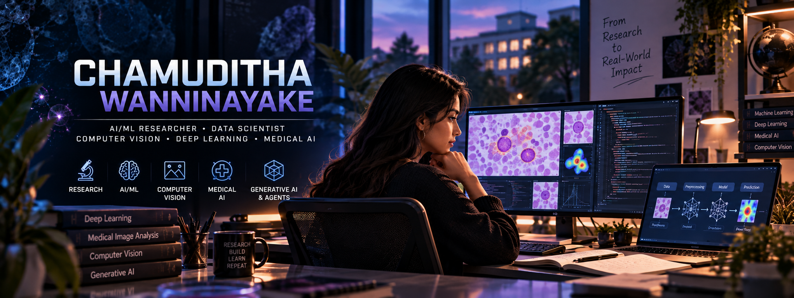

  

# 👋 Hi, I'm Chamuditha Wanninayake

### 🔬 AI/ML Researcher • Data Scientist • Computer Vision & Deep Learning

I'm a **Data Science graduate and AI/ML researcher** interested in building intelligent systems that solve meaningful real-world problems.

My main interests are **Computer Vision, Deep Learning, Medical AI, Machine Learning, and Generative AI**. I enjoy working at the intersection of research and engineering — exploring ideas, developing models, and turning them into practical systems.

🔬 AI/ML Researcher  
🧠 Computer Vision & Deep Learning  
🏥 Medical AI & Image Analysis  
🤖 Generative AI & Agentic Systems  
📄 IEEE Published Researcher  
🌱 Always learning, experimenting, and building

---

## 🔬 Research Interests

**Computer Vision** • **Deep Learning** • **Medical Image Analysis** • **Machine Learning** • **Generative AI** • **Intelligent Systems**

My research experience includes AI-assisted malaria diagnosis and computer-vision-based blood-smear quality assessment.

---

## 🛠️ Technologies & Tools

### 👨‍💻 Programming Languages

  

### 🤖 Machine Learning & Deep Learning

  

  
  
  
  

### ✨ Generative AI & AI Agents

  
  
  

`Microsoft Copilot Studio` • `Azure AI Foundry` • `AI Agent SDK` • `Bot Framework` • `Prompt Engineering` • `RAG`

### 🌐 Web & Backend Development

  

`REST APIs` • `Spring Boot` • `Spring Security` • `OAuth 2.0`

### 🗄️ Databases

  

### ☁️ Cloud & Infrastructure

  

### 🔧 Development Tools

  

### 🎨 3D & Interactive Technologies

  

`Three.js` • `3D Avatar Modelling` • `Viseme Animation`

---

## 📚 Research & Projects

I use GitHub to share my **research experiments, AI projects, implementations, and technical explorations**.

My work mainly focuses on:

🩸 **Medical AI & Computer Vision**  
AI-assisted analysis of biomedical images and diagnostic support systems.

🧠 **Deep Learning**  
Model development, experimentation, evaluation, and explainability.

🤖 **Generative AI & Agentic Systems**  
Exploring intelligent agents, enterprise AI systems, and modern AI applications.

---

## 📄 Featured Publication

### 🩸 Pre-Analytical Quality Validation for Malaria Diagnosis: A Multi-Stage Deep Learning and Computer Vision Framework

**2026 18th International Conference on Electronics, Computers and Artificial Intelligence (ECAI)**

📍 Bucharest, Romania  
🏛️ IEEE  
🔗 DOI: [`10.1109/ECAI69016.2026.11613683`](https://ieeexplore.ieee.org/document/11613683)

---

## 📊 GitHub Statistics

  
  

---

## 🌱 Currently

🔬 Advancing my work in **AI/ML research**

🧠 Exploring **Computer Vision & Deep Learning**

🏥 Interested in **Medical AI**

🤖 Building and experimenting with **Generative AI & Agentic Systems**

📚 Developing as a **researcher and AI engineer**

---

## 🤝 Let's Connect

I'm always open to:

🔬 Research collaborations  
🤖 AI/ML projects  
💻 Open-source development  
📚 Research discussions  
🎓 Academic opportunities

  

  

  

  

  

---

  <i>Research • Build • Learn • Repeat.</i>

